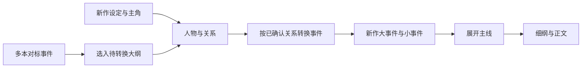

# 行舟影视：批量确认与洗稿人物关系锚定设计

日期：2026-10-08。基线：2.8.6，提交 `b6099d6`。状态：架构设计待用户审阅；本文没有声明功能已实现或已发布。

## 1. 目标与已明确的要求

原创框架区：一次确认当前全部大事件内容及顺序，不必逐卡点击勾选；操作后留在主线页，小事件由用户自行通过左侧目录进入。

洗稿区：从多本对标书借用事件时，以新作主角和关系网统一人物身份。原名是来源线索，不是匹配人物的依据。转换覆盖大事件和小事件，在展开主线之前完成，不采用写完全剧后再全文换名的办法。

人物区保留，但主要用途变为建立新作人物、确认来源角色对应、统一事件参与者与称谓。用户可以自然语言说明，Agent 负责整理；无需逐个填写性格、命运、动机等大表单。已有手动编辑、候选审阅、模型选择、本地保存和历史版本继续保留。

## 2. 当前代码中的缺口

- `core/frameworkWorkflow.js:239` 的 `mainline.orderConfirm` 只确认位置顺序，不确认各大事件内容；`src/creator/framework/ComponentPanes.jsx` 的按钮随后自动跳转小事件页。
- `core/rewriteOutline.js` 的 `copyOutlineGroups` 为复制事件生成新 ID，并保留 `(sourceId, groupId, eventId)` 出处，但没有转换事件中的人物。出处结构适合继续使用。
- `src/creator/RewriteWorkspace.jsx` 的 `appendOutline`、`bookCard` 把来源文字直接加入新作大纲；`characters` 的生成指令主要是性格、动机和命运分析。
- `core/rewriteStory.js` 虽已要求不要把对标人物名字当新作事实，却只传入确认人物文字和参考事件，缺少可校验的角色对应关系。
- `core/rewriteOutline.js`、`core/rewriteMainline.js` 的读取函数只保留部分字段。新增人物 ID、转换版本等元数据必须贯穿读写，不能被规范化时丢掉。
- `core/rewriteWorkflow.js` 的版本快照目前保存区域文字、分集与事件引用，需一起保存对应的人物关系版本。

以上是本次源代码核对，不是对真实模型转换质量的验收。

## 3. 方案选择

| 方案 | 用户操作 | 多来源一致性 | 选择 |
|---|---|---|---|
| 完成全剧后批量换名 | 表面步骤少，但需反复修正称谓与指代 | 无法可靠处理同名、不同关系、跨书合并 | 不采用 |
| 每张事件卡分别填写人物对应 | 多次重复填写，长项目负担大 | 容易出现局部不一致 | 不作为主要操作 |
| 新作人物库＋来源关系映射＋事件转换 | 一次说明新作人物，批量审阅对应和转换结果 | 来源独立标识，新作身份统一 | **采用此设计** |

逻辑依据：`来源作品＋来源角色身份＋主角关系` → `新作人物稳定 ID`。姓名只是显示属性。AI 用事件、证据和关系提出映射，用户确认决定映射；不能因为两个名字相似或都叫“妈妈”就合并。

## 4. 创作流程与人物区

左侧顺序调整为：总剧本、对标剧本；设定 → 大纲 → **人物与关系** → 主线 → 细纲 → 分集正文。来源的“人物拆解”是参考证据，与新作人物库区分。

大纲允许先引用素材搭建结构。未经转换的引用卡片显示“待统一人物”，属于素材草稿，不因位置在右侧就成为已确定的新作人物事实。采用新作大纲、展开相关主线时检查转换状态，必要时引导到人物区，不静默继承原书人名。

人物区采用左右工作布局：

- 左侧：新作人物卡。主角优先显示；配角按关系称谓显示。默认展示姓名/称谓和最必要的关系，不占据大块空表单。旧性格、命运分析在折叠资料中保留。
- 右侧：一句话输入，例如“新作女主夏初雪，男主陆舟；来源女主的母亲转为夏初雪的母亲，暂不命名”。旁边选择模型，执行“整理新作人物与关系”。
- 来源对应按书分组折叠，优先展示未决或冲突条目。顶部显示“已确认对应 / 待确认对应”，可以批量确认全部无冲突候选；有冲突时只需处理例外。
- 主操作为“转换全部待处理事件”，也支持转换所选组或单个事件。结果先预览，提供修改要求和再次生成入口。采用、取消等操作固定在底栏，浮窗可拖动。

新作主角已经出现在确认设定中时，Agent 读取该设定提取候选，不要求用户重复填写。不强制每部作品都有男女两位主角，不按性别把角色机械合并。

## 5. 人物与关系的数据边界

人物身份结构保存在项目本地 `creator.rewrite.identity`，与已有 `sections.characters` 的文字资料兼容。前者用于校验，后者保留供阅读与旧版本恢复。

| 数据 | 必要字段与用途 |
|---|---|
| 新作人物 `people` | 稳定 `id`、显示姓名或称谓、主角/配角角色、确认状态。未命名人物也有稳定 ID。 |
| 新作关系 `relations` | 稳定 `id`、起点/终点人物 ID、关系类型、确认状态。支持母亲、养母、同事等不同关系。 |
| 来源人物 `sourceActors` | `sourceId`＋稳定来源角色 ID、原名及别称、来源关系和证据位置。每本书独立命名空间。 |
| 对应 `bindings` | 来源角色 ID → 新作人物 ID、关系依据、确认状态、歧义说明。允许多个来源角色映射同一新作人物，但不按名字自动决定。 |
| 版本状态 | schema 版本、内容 `revision`、确认状态、提取/映射/转换历史。 |

名字相同但来自不同书的角色是不同来源身份。一本书中同名的两个人也需独立身份和证据，不以 `(sourceId, name)` 作为唯一键。

“女主母亲”是连到新作女主的一个人物节点和关系边，不只是临时字符串。若来源角色可能是母亲、养母或继母，必须提出待决对应。来源的陌生次要人物可以使用明确的关系称谓，但不能凭空新增已确认关系。

新作有姓名时使用新作姓名；没有姓名时使用已确认关系称谓。不同来源的小故事最终引用同一套新作人物 ID。改变显示名不会改变身份 ID。

## 6. Agent 任务与事件转换

任务拆成三个可审阅环节，用户主要用批量入口：

1. **整理人物与对应。** 从新作确认设定、用户要求和所选来源证据提出新作人物及关系映射。未采用输出不会进入主线约束。
2. **转换事件。** 读取已确认人物库和对应关系，以及选入大纲的相关来源事件。输出新作事件内容、参与者 ID、转换说明和未决问题。
3. **检查一致性。** 核对使用的人物 ID、主角身份、关系称谓、已定事件目标及跨事件衔接；再展开主线、细纲和正文。

转换是重新表达事件中的行动、对白称呼、心理、关系和必要的指代，不是 `replaceAll`。保留用户当前事件作用、顺序及已定结果；如果来源人物动机与新作设定无法兼容，在候选中列出问题，不能擅自更改已定结果。

已有出处 `(sourceId, groupId, eventId)` 保留，不因转换到新作而丢失。事件增加 `participantIds`、所用人物关系版本和转换状态。所有读写/复制/模拟/主线对齐函数保留这些字段。

用户自创、没有来源引用的事件直接使用新作人物库，不需要虚构来源映射。没有确定参与者的草稿可以先保存；正式展开相关事件前处理关键人物歧义。

默认批量行为：保留当前顺序和稳定 ID，只转换待处理的可编辑事件；已转换且依据未变化的事件不重复生成。锁定内容跳过并显示原因，不能静默覆盖。

## 7. 采用门槛与变更失效

需要同时在生成前和采用时校验，不能只在按钮上禁用：

- 新作人物和关系 ID 存在，绑定来源存在；关系不能指向已删除的人物。
- 输出只包含指定大纲事件，保留原大事件/小事件 ID、归属、顺序和出处。重复、遗漏或跨组引用拒绝采用。
- `participantIds` 都来自当前确认人物库；来源角色不能被当作新作人物 ID。
- 涉及主角和关键关系的未决对应，阻止相关事件的正式转换采用/主线展开；不阻止用户本地记录草稿，不要求处理未引用的整本书全部配角。
- 来源姓名检查只针对新作创作正文等业务文本，不扫描来源原文、出处说明和历史档案。新作主动采用同一个姓名是合法情形。不能用短姓氏全局匹配来误报普通文字。
- 转换输入指纹包含来源、事件文本、引用、新作人物及关系版本、用户指令。生成期间任一依据变化，结果保留为历史候选，不能覆盖当前稿。
- 任何一处验证失败，批量采用整批回滚，不出现一半写入、一半失败。

改名、改变关系或重新绑定时，标记相关事件转换待复核，并沿依赖链标记相关主线/细纲/正文需复核；保留现有文字和确认历史，不自动全文换名。受影响范围可以从参与者 ID/绑定出处定位；旧数据缺少结构信息时，保守标记相关来源的事件需复核。

确认大纲本身不应反向令人物库失效。只有人物关系的依据变化才影响人物确认；人物调整影响转换结果。重新设计现有 `SECTION_DEPENDENCIES`，避免“大纲使人物过期、人物又使大纲过期”的确认循环。

## 8. 原创一键确认

在主线页用“一键确认全部”替代“确认顺序，展开小事件”，按钮说明为“确认全部大事件内容及当前排列顺序”。

- 原子检查所有卡片有标题和事件正文；空白卡片指出位置，不部分确认。
- 同时标记各大事件 `confirmed=true` 和 `mainline.orderConfirmed=true`。
- 保持全部小事件确认状态、全剧故事稿确认状态不变；不触发 AI，不自动跳转。
- 已固定且已确认卡片原样保留；已固定但未确认卡片提示先解除固定，不能绕过锁定边界。
- 单卡确认功能保留，用户仍可只确认某张卡片。调整大事件内容或排序后，按现有规则重新复核。

## 9. 旧项目、历史与本地保存

- 升级不自动改写已有剧本、不把旧人物分析直接当成确认绑定。第一次进入新人物区显示“旧人物资料待整理”，原文折叠保留。
- 旧大纲、旧主线和正文继续可查看、编辑、导出。重新调用 Agent 转换或展开引用事件时，执行新人物关系校验。
- 支持“整理现有稿件的人物”生成迁移候选，对照旧文采用，保留旧文快照。已有锁定稿件不能自动迁移覆盖。
- 细纲/大纲版本快照增加人物库、关系、绑定和转换状态。切换旧版本时恢复该版本一致的内容与人物依据；旧快照没有身份结构则显示待整理，不从另一版本静默补入。
- 移除来源后保留已采用事件、文字及历史出处快照；指向已移除来源的对应标为不可解析，阻止依赖该来源的新增转换，不删除新作人物或已写稿件。
- 编辑先在当前字段更新，本地草稿缓冲保存。调用 Agent 时才联网；资料内容不写进日志，未提交要求可恢复。保留现有安全边界。

## 10. 实现范围

| 区域 | 计划涉及的模块 |
|---|---|
| 原创确认 | `core/frameworkWorkflow.js`、`src/creator/framework/ComponentPanes.jsx`、对应原子确认测试 |
| 新作身份逻辑 | 新增 `core/rewriteIdentity.js`：规范化、映射校验、版本/失效、转换输入和采用校验 |
| 人物界面 | 新增 `src/creator/RewriteIdentityPane.jsx`，整合 `RewriteWorkspace.jsx` 导航、模型和 Agent 入口 |
| 事件结构 | `rewriteOutline.js`、`rewriteMainline.js`、`rewriteStory.js`：保留元数据并检查身份约束 |
| 模拟与任务 | `rewriteWorld.js`、`rewriteWorkflow.js`、`creatorAi.js`、`creatorWorkspace.js`：引用/生成/采用与指纹贯通 |
| 版本恢复 | `rewriteWorkflow.js` 的版本快照与切换，保存一致人物依据 |
| 发布 | 完成验证后升级为 2.8.7，发布说明、源码提交、安装包和签名更新清单 |

这次不加入新的独立人物线、命运分析主页面，也不改云端收费、登录或权限协议。角色关系处理可与原创整理规则共用概念，但不把洗稿和原创的已有项目数据强行合并。

## 11. 验收用例

1. 原创 13 张完整大事件，一次全部确认，主线页不跳转、无模型调用；有一张空白时整批不变化；固定卡片规则正确。
2. 两本来源主角名字不同、甚至角色同名：映射后同一新作主角贯穿大小事件、主线、细纲和正文。
3. 来源女主母亲有不同姓名，均映射到新作女主的母亲；母亲/继母/养母混淆时提出冲突，不能静默合并。
4. 新作主角在设定中已确认，人物区无需重复填写；未引用的配角不阻塞工作。
5. 只转换选中/待处理事件，出处、稳定 ID、归属、顺序和锁定文字不变；采用前原稿不变。
6. 改名或改映射后，旧候选被拒绝，关联后续内容标为待复核，其他事件不被自动覆盖。
7. 旧文字项目、旧版本快照、已有主线和锁定正文均可恢复；移除来源不会删稿。
8. 人物要求和事件正文在本地可编辑、保存、恢复；浮窗拖动及固定底栏可用；常见窗口宽度下两栏合理，无空表单占满页面。
9. 用真实任务构建与采用逻辑配合模拟外部接口验证，不调用付费模型。跑完整 `npm test`、生产构建、浏览器交互、实际打包运行与公开更新清单核对。

这些是待实现的验收标准，不是已通过的测试结果。人物映射的生成质量仍由模型和用户审阅共同决定，结构校验不能宣称理解了全部剧情。
